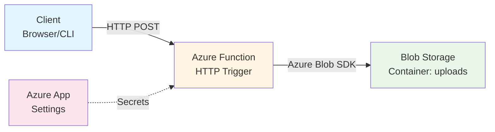

<div align="center">

# ☁️ Azure File Uploader

### Serverless File Upload Solution

**Built with Azure Functions (Python) + Azure Blob Storage**

[](https://www.python.org/downloads/)
[](https://azure.microsoft.com/en-us/services/functions/)
[](LICENSE)

[Features](#-features) • [Architecture](#-architecture) • [Quick Start](#-quick-start) • [Deployment](#-deployment) • [Security](#-security)

</div>

---

## 📋 Overview

A **production-ready**, **lightweight**, and **highly scalable** serverless file uploader that:

- ✅ Accepts HTTP POST requests with raw file data
- ✅ Uploads files securely to Azure Blob Storage
- ✅ Returns structured upload confirmations
- ✅ Scales automatically based on demand
- ✅ Zero maintenance - runs on Azure's managed infrastructure

---

## ✨ Features

<table>
<tr>
<td width="50%">

### 🚀 Performance
- **Serverless Architecture** - Pay only for what you use
- **Auto-scaling** - Handles 1 or 10,000 requests seamlessly
- **Chunked Uploads** - Built-in support for large files
- **Automatic Retries** - SDK handles transient failures

</td>
<td width="50%">

### 🔐 Security
- **Private Blob Containers** - No public access by default
- **Managed Secrets** - Uses Azure App Settings
- **Function-level Authentication** - Requires API keys
- **HTTPS Enforcement** - Secure transport layer

</td>
</tr>
</table>

---

## 🏗️ Architecture



### Component Roles

| Component | Purpose | Technology |
|-----------|---------|------------|
| **Client** | Initiates file upload requests | Any HTTP client (browser, cURL, Postman) |
| **Azure Function** | Processes uploads & handles routing | Python 3.10+ with Azure Functions runtime |
| **Blob Storage** | Persistent file storage | Azure Blob Storage (private container) |
| **App Settings** | Secure credential management | Azure Key Vault integration |

---

## 🚀 Quick Start

### Prerequisites

Before you begin, ensure you have:

```bash
✓ Python 3.10 or higher
✓ Azure CLI installed
✓ Azure Functions Core Tools (func)
✓ An active Azure subscription
✓ An Azure Storage Account
```

<details>
<summary><b>📦 Installation Links</b></summary>

- [Python Downloads](https://www.python.org/downloads/)
- [Azure CLI Setup](https://docs.microsoft.com/en-us/cli/azure/install-azure-cli)
- [Azure Functions Core Tools](https://docs.microsoft.com/en-us/azure/azure-functions/functions-run-local)

</details>

---

### 🛠️ Local Development Setup

#### **Step 1: Clone & Environment Setup**

```bash
# Clone the repository
git clone https://github.com/priyanshurai5432-droid/azure-file-uploader.git
cd azure-file-uploader

# Create virtual environment
python -m venv .venv

# Activate virtual environment
# Windows PowerShell:
.\.venv\Scripts\Activate.ps1

# Windows CMD:
.\.venv\Scripts\activate.bat

# Linux/macOS:
source .venv/bin/activate
```

#### **Step 2: Install Dependencies**

```bash
pip install -r requirements.txt
```

#### **Step 3: Configure Local Settings**

Create `local.settings.json` in the project root:

```json
{
  "IsEncrypted": false,
  "Values": {
    "FUNCTIONS_WORKER_RUNTIME": "python",
    "AZURE_STORAGE_CONNECTION_STRING": "YOUR_CONNECTION_STRING_HERE"
  }
}
```

> ⚠️ **IMPORTANT**: This file contains secrets and is git-ignored. Never commit it to version control.

<details>
<summary><b>🔍 How to get your connection string</b></summary>

```bash
az storage account show-connection-string \
  --name <your-storage-account-name> \
  --resource-group <your-resource-group> \
  --query connectionString -o tsv
```

</details>

#### **Step 4: Run Locally**

```bash
# Start the function runtime
func start

# You should see output like:
# Http Functions:
#     upload_file: [POST] http://localhost:7071/api/upload_file
```

#### **Step 5: Test Your Function**

**PowerShell:**
```powershell
Invoke-RestMethod `
  -Uri "http://localhost:7071/api/upload_file?filename=test.txt" `
  -Method POST `
  -Body "Hello from local development!"
```

**cURL:**
```bash
curl -X POST \
  "http://localhost:7071/api/upload_file?filename=test.txt" \
  -d "Hello from local development!"
```

**Expected Response:**
```
✅ Uploaded 'test.txt'
```

---

## 🌐 Deployment

### Azure Infrastructure Requirements

Ensure these resources exist before deployment:

- ✅ **Resource Group**: `rg-fileuploader-dev`
- ✅ **Storage Account**: With a container named `uploads`
- ✅ **Function App**: `func-fileuploader-realtime`

### Deploy to Azure

```bash
# Login to Azure
az login

# Deploy the function
func azure functionapp publish func-fileuploader-realtime
```

### Configure Production Settings

```bash
# Set the storage connection string
az functionapp config appsettings set \
  --name func-fileuploader-realtime \
  --resource-group rg-fileuploader-dev \
  --settings AZURE_STORAGE_CONNECTION_STRING="YOUR_CONNECTION_STRING"
```

### Retrieve Function Key

```bash
# Get the function key for authentication
$KEY = $(az functionapp function keys list `
  --name func-fileuploader-realtime `
  --resource-group rg-fileuploader-dev `
  --function-name upload_file `
  --query "default" -o tsv)
```

### Test Production Endpoint

```powershell
Invoke-RestMethod `
  -Uri "https://func-fileuploader-realtime.azurewebsites.net/api/upload_file?filename=production_test.txt&code=$KEY" `
  -Method POST `
  -Body "Hello from Azure!"
```

**Expected Response:**
```
✅ Uploaded 'production_test.txt'
```

---

## 🔐 Security

### Security Best Practices

<table>
<thead>
<tr>
<th width="30%">Risk</th>
<th width="35%">Mitigation</th>
<th width="35%">Implementation</th>
</tr>
</thead>
<tbody>
<tr>
<td>🚨 <b>Hardcoded Secrets</b></td>
<td>Use Azure App Settings</td>
<td><code>az functionapp config appsettings set</code></td>
</tr>
<tr>
<td>🚨 <b>Public Container Access</b></td>
<td>Keep containers private</td>
<td>Set blob container access level to <code>private</code></td>
</tr>
<tr>
<td>🚨 <b>Unauthorized Access</b></td>
<td>Require function keys</td>
<td>Use <code>authLevel="function"</code> in trigger</td>
</tr>
<tr>
<td>🚨 <b>Uncontrolled File Sharing</b></td>
<td>Generate time-limited SAS tokens</td>
<td>Create SAS links with expiration dates</td>
</tr>
<tr>
<td>🚨 <b>Unrestricted File Uploads</b></td>
<td>Implement file type validation</td>
<td>Check file extensions and MIME types</td>
</tr>
</tbody>
</table>

### Recommended Enhancements

```python
# Add file type validation
allowed_extensions = ['.txt', '.pdf', '.jpg', '.png']
if not any(filename.endswith(ext) for ext in allowed_extensions):
    return func.HttpResponse("File type not allowed", status_code=400)

# Add file size limits
max_size_mb = 10
if len(file_data) > max_size_mb * 1024 * 1024:
    return func.HttpResponse("File too large", status_code=413)
```

---

## 💸 Cost Model

### Consumption Plan Pricing

This solution uses **Azure Functions Consumption Plan** - you only pay for what you use:

| Resource | Pricing Model | Free Tier |
|----------|---------------|----------|
| **Function Executions** | Per 1M requests | First 1M free/month |
| **Execution Time** | Per GB-second | First 400,000 GB-s free/month |
| **Blob Storage** | Per GB stored + operations | 5 GB free (with LRS redundancy) |

**Example Cost Calculation:**
- 10,000 uploads/month @ 1 second each = ~$0.02
- 10 GB stored = ~$0.21/month
- **Total: ~$0.23/month** for moderate usage

> 💡 **No uploads = no charges** - Perfect for development and testing!

---

## 🧠 Key Concepts

<table>
<tr>
<td width="33%" align="center">

### ⚡ Event-Driven
Functions execute only when triggered by HTTP requests

</td>
<td width="33%" align="center">

### 🔐 Secure by Default
Function keys + private containers + managed secrets

</td>
<td width="33%" align="center">

### 📈 Auto-Scaling
Azure handles infrastructure scaling automatically

</td>
</tr>
</table>

---

## 📂 Project Structure

```
azure-file-uploader/
│
├── 📄 function_app.py          # Main function logic & HTTP trigger
├── 📄 host.json                 # Function host configuration
├── 📄 requirements.txt          # Python dependencies
├── 📄 .gitignore                # Excludes secrets & build artifacts
├── 📄 README.md                 # This file
└── 📄 local.settings.json       # Local dev settings (git-ignored)
```

---

## 🔄 Extending This Project

### Suggested Features

- [ ] **SAS Link Generation** - Return time-limited download URLs
- [ ] **File Listing API** - Retrieve all uploaded files
- [ ] **File Deletion Endpoint** - Manage blob lifecycle
- [ ] **Web Frontend** - HTML/JavaScript upload interface
- [ ] **Metadata Tagging** - Add custom properties to blobs
- [ ] **Virus Scanning** - Integrate Azure Defender for Storage
- [ ] **Thumbnail Generation** - For image uploads
- [ ] **Database Logging** - Track uploads in Cosmos DB

---

## ⚠️ Important Notes

> 🔒 **`local.settings.json` is git-ignored** - Never commit secrets to version control

> 📦 **Large File Handling** - Azure Blob SDK automatically chunks uploads for files over 256 MB

> 🌍 **CORS Configuration** - If building a web frontend, configure CORS in Azure Portal

> 🔄 **Retry Logic** - Built into the Blob SDK for transient network failures

---

## 🤝 Contributing

Contributions are welcome! Please feel free to submit a Pull Request.

1. Fork the repository
2. Create your feature branch (`git checkout -b feature/AmazingFeature`)
3. Commit your changes (`git commit -m 'Add some AmazingFeature'`)
4. Push to the branch (`git push origin feature/AmazingFeature`)
5. Open a Pull Request

---

## 📝 License

This project is licensed under the **MIT License** - see the [LICENSE](LICENSE) file for details.

Free for educational and personal use.

---

## 👨‍💻 Author

**Priyanshu Rai**

- GitHub: [@priyanshurai5432-droid](https://github.com/priyanshurai5432-droid)
- Project Link: [https://github.com/priyanshurai5432-droid/azure-file-uploader](https://github.com/priyanshurai5432-droid/azure-file-uploader)

---

<div align="center">

### ⭐ Star this repo if you find it helpful!

**Made with ❤️ using Azure Functions & Python**

</div>
